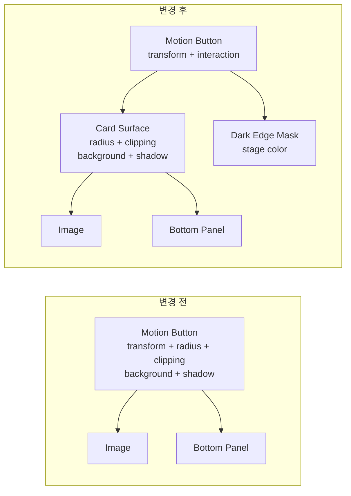

# 다크 모드 카드에만 생긴 흰 라인: Framer Motion과 둥근 모서리의 합성 경계를 분리해 해결하기

라이트 모드에서는 아무 문제 없이 예쁘게 보이던 카드가 다크 모드로 전환하면 하단 모서리에만 희미한 흰 선을 드러냈습니다. `border`를 확인해도 분명히 `0px`이고, 카드와 하단 패널의 배경색까지 맞췄는데 선은 사라지지 않았습니다. 처음에는 간단한 CSS 문제라고 생각했지만, 수정할수록 조금 옅어질 뿐 끝까지 남더라구요..

이번 글에서는 소리마루의 `장면을 따라 걷는 소리` 카드에서 발생한 이 문제를 어떻게 재현하고 좁혀 갔는지, 왜 라이트 모드보다 다크 모드에서 훨씬 선명하게 보였는지, 그리고 카드의 둥근 모서리를 포기하지 않으면서 어떤 구조로 해결했는지를 정리해 보겠습니다.

## 라이트 모드에서는 괜찮은데 다크 모드에서만 선이 보였다

문제가 발생한 화면은 여러 장의 오디오 이야기 카드를 `scale`, `rotate`, `translateY`로 배치하는 편집형 레일입니다. 가운데 카드는 크게 표시하고 양옆 카드는 살짝 축소하고 기울여, 사진을 펼쳐 놓은 듯한 인상을 주는 UI입니다.

사용자가 처음 제보한 화면을 확대해 보면 카드의 하단 좌우 모서리를 따라 회색에 가까운 밝은 픽셀이 이어져 있습니다. 일반적인 1px 테두리처럼 보이지만, 실제 계산 스타일에서 카드의 `border-width`는 `0px`이었습니다.


*카드 하단의 둥근 경계를 따라 밝은 점선 형태의 픽셀이 보였습니다.*

동일한 1440px 뷰포트와 동일한 5개 목 데이터를 사용해 문제가 남아 있던 커밋을 다시 실행한 화면입니다. 전체 크기로 보면 아주 작은 차이지만, 짙은 무대 배경 위에 카드가 반복해서 배치되니 이 선이 꽤 이질적으로 느껴졌습니다.


*변경 전: 카드의 하단 라운드에 밝은 합성 경계가 남아 있었습니다.*

반면 라이트 모드는 흰색 계열의 카드와 배경, 이미지 페이드가 자연스럽게 섞였습니다. 같은 안티앨리어싱 픽셀이 생기더라도 주변 명도와 차이가 작아 거의 인식되지 않았습니다.


*라이트 모드: 기존 카드의 둥근 형태와 페이드 효과를 그대로 유지했습니다.*

이 차이는 다크 모드 색상 조합에서 더 분명해집니다. 무대 배경은 `#171E2B`, 카드 표면은 `#212734`였습니다. 카드 가장자리에서 브라우저가 만든 반투명 픽셀이 두 색 사이에 놓이면서 실제 CSS에 없는 밝은 외곽선처럼 보인 것입니다.

## 처음에는 border와 하단 패널을 의심했다

가장 먼저 확인한 것은 당연히 `border`였습니다. 다크 카드에는 이전 작업에서 사용하던 `rgba(255, 255, 255, 0.08)` 외곽선이 있었고, 이를 제거하면 문제가 해결될 것처럼 보였습니다. 하지만 외곽선을 제거한 뒤에도 하단 모서리의 밝은 픽셀은 남았습니다.

다음으로 하단 정보 패널을 살펴봤습니다. 당시 패널은 부모 카드와 별개로 하단 라운드를 가지고 있었고, 반투명 배경과 `backdrop-filter`까지 적용하고 있었습니다. 부모 카드와 자식 패널이 각각 같은 위치에서 둥근 모서리를 자르면 두 개의 안티앨리어싱 경계가 겹칠 수 있습니다. 그래서 패널의 별도 라운딩을 제거하고, 다크 모드에서는 카드와 같은 불투명 배경을 사용하도록 바꿨습니다.

이 수정으로 경계가 옅어지기는 했습니다. 하지만 완전히 없어지지는 않았습니다. 여기서부터 이 문제가 단순한 테두리 색상 문제가 아니라 렌더링 레이어의 합성 문제라는 단서가 보이기 시작했습니다.

| 시도 | 기대한 결과 | 실제 결과 |
| --- | --- | --- |
| 카드의 흰색 외곽선 제거 | 1px 링 제거 | 일부만 옅어지고 하단 프린지는 유지 |
| 하단 패널의 중복 라운딩 제거 | 부모와 자식의 이중 클리핑 제거 | 모서리는 개선됐지만 밝은 픽셀은 유지 |
| 패널을 불투명 카드 색으로 통일 | 페이지 배경이 섞이는 현상 제거 | 투명 합성은 줄었지만 GPU 경계는 유지 |
| 무대색 border·outline·inset shadow 적용 | 밝은 픽셀을 같은 색으로 덮기 | 브라우저의 최종 클리핑 뒤에 다시 경계가 생성됨 |
| 다크 모드 하단 라운드 제거 | 클리핑 경계 자체 제거 | 선은 사라졌지만 카드 디자인도 훼손되어 폐기 |

마지막 시도는 기술적으로는 선을 없앴지만 제품 관점에서는 정답이 아니었습니다. 둥근 카드가 이 레일의 시각 언어인데 버그를 피하려고 하단 라운드를 없애 버리면, 문제를 해결한 것이 아니라 디자인을 포기한 셈이니까요. 이 지점에서 접근을 다시 바꿨습니다.

## 하나의 motion 요소가 너무 많은 역할을 맡고 있었다

기존 카드에서 `motion.button`은 애니메이션과 카드 표면을 모두 담당했습니다. 하나의 DOM 요소에 이동·회전·확대, 둥근 모서리, clipping, 배경색, 그림자, grayscale 필터가 함께 적용된 구조였습니다.

```tsx
<CardMotionButton>
  <CardImageLayer />
  <CardBottomPanel />
</CardMotionButton>
```

```css
CardMotionButton {
  transform: scale(...) rotate(...) translateY(...);
  overflow: hidden;
  border-radius: 20px;
  background: #212734;
  box-shadow: ...;
  filter: grayscale(...);
}
```

Framer Motion이 `transform`을 적용하면 브라우저는 해당 요소를 별도의 합성 레이어로 승격할 수 있습니다. 이 레이어가 자기 자신에게 `border-radius`와 `overflow: hidden`까지 적용하면, 브라우저는 둥근 외곽의 픽셀을 반투명하게 잘라낸 뒤 배경과 합성합니다. 라이트 모드에서는 주변 색이 밝아 티가 나지 않았지만, 다크 모드에서는 카드와 무대의 명도 차이 때문에 이 픽셀이 작은 흰 선처럼 강조됐습니다.

핵심은 `border-radius` 값 자체가 잘못된 것이 아니었습니다. **움직이는 레이어가 자기 자신의 최종 외곽까지 직접 잘라내고 있다는 구조**가 문제였습니다.

## 애니메이션과 카드 표면을 서로 다른 레이어로 분리했다

최종 해결에서는 외부 버튼과 실제 카드 면의 책임을 나눴습니다. `CardMotionButton`은 위치·회전·확대와 클릭만 담당하고, 내부의 `CardSurface`가 배경·그림자·20px 라운드·clipping을 담당합니다. 다크 모드에는 `CardEdgeMask`라는 별도 형제 레이어를 두어, 카드 표면의 둥근 형태를 유지한 채 가장자리의 합성 픽셀만 무대색으로 덮었습니다.



*애니메이션 컨테이너와 실제 카드 표면을 분리하고, 다크 모드 마스크를 clipping 바깥에 배치했습니다.*

외부 버튼은 더 이상 둥근 모서리를 자르지 않습니다. 애니메이션을 위한 투명 컨테이너로만 동작합니다.

```tsx
const CardMotionButton = styled(motion.button)`
  position: relative;
  overflow: visible;
  border-radius: 0;
  background-color: transparent;
`;
```

실제 카드 표면은 내부 레이어가 담당합니다. 라이트와 다크 모두 이 레이어가 20px 라운드를 유지하기 때문에 테마가 바뀌어도 카드 형태는 동일합니다.

```tsx
const CardSurface = styled.div<{ $isActive: boolean }>`
  position: absolute;
  inset: 0;
  overflow: hidden;
  border-radius: 1.25rem;

  [data-theme='dark'] & {
    background-color: ${surface.dark.card};
    box-shadow: ${({ $isActive }) =>
      $isActive
        ? '0 14px 32px rgba(0, 0, 0, 0.45)'
        : '0 4px 14px rgba(0, 0, 0, 0.25)'};
  }
`;
```

다크 모드 마스크는 `CardSurface` 안이 아니라 바깥 버튼의 형제 요소로 배치했습니다. 마스크를 카드 내부에 넣으면 부모의 clipping 결과와 함께 다시 잘려 나가므로, 최종 합성 경계를 덮을 수 없습니다. `inset: -1px`과 3px 무대색 테두리를 사용해 카드의 안티앨리어싱 픽셀만 덮고, `pointer-events: none`으로 카드 클릭에는 관여하지 않게 했습니다.

```tsx
const CardEdgeMask = styled.div`
  display: none;

  [data-theme='dark'] & {
    position: absolute;
    inset: -1px;
    z-index: 30;
    display: block;
    border: 3px solid ${surface.dark.surface};
    border-radius: 21px;
    pointer-events: none;
  }
`;
```

최종 JSX 구조는 다음과 같습니다.

```tsx
<CardMotionButton animate={{ y, rotate, scale }}>
  <CardSurface $isActive={isActive}>
    <CardImageLayer />
    <CardBottomPanel />
  </CardSurface>

  <CardEdgeMask />
</CardMotionButton>
```

이 구조에서는 둥근 카드와 그림자를 그대로 유지하면서도, transform을 담당하는 요소가 직접 clipping하지 않습니다. 마스크 역시 라이트 모드에서는 `display: none`이므로 기존 라이트 카드의 색감과 페이드는 전혀 바뀌지 않습니다.

## 변경 후에는 다크 카드의 형태를 유지하면서 경계만 사라졌다

최종 구조를 적용한 다크 모드 화면입니다. 변경 전과 동일한 데이터와 배치이지만, 카드 하단 라운드는 그대로 유지되고 밝은 점선 경계만 사라졌습니다.


*변경 후: 20px 라운드와 그림자는 유지하면서 합성 프린지만 무대색 마스크로 정리했습니다.*

이번 수정에서 중요했던 것은 “보기 좋게 비슷해졌다”에서 끝내지 않는 것이었습니다. 회귀 테스트는 브라우저가 계산한 실제 스타일을 읽어 다음 계약을 확인합니다.

- 라이트·다크 모두 실제 카드 표면의 `border-radius`는 20px입니다.
- 외부 모션 버튼은 `overflow: visible`이며 직접 clipping하지 않습니다.
- 라이트 모드에서는 `CardEdgeMask`가 렌더링되지 않습니다.
- 다크 모드 마스크의 색상은 무대 배경색과 정확히 같습니다.
- 하단 패널은 별도 라운드를 만들지 않고 `CardSurface` 안에서 한 번만 잘립니다.

Playwright에서는 라이트 모드의 기존 카드 형태와 화살표 hover 동작, 다크 모드의 내부 표면과 외곽 마스크를 각각 확인했습니다. 컴포넌트 테스트 10건과 TypeScript, ESLint도 함께 통과시켜 구조 변경이 카드 선택이나 애니메이션 로직을 건드리지 않았는지 확인했습니다.

## 작은 흰 선 하나가 레이어의 책임을 다시 생각하게 했다

처음에는 `border: none` 한 줄이면 끝날 문제처럼 보였습니다. 그런데 실제 원인은 border가 아니라 transform, clipping, 배경, 그림자를 하나의 요소가 동시에 책임지면서 만들어진 합성 경계였습니다. 하단 패널의 투명도와 중복 라운딩을 정리하는 것도 필요했지만, 그것만으로는 최종 GPU 합성 단계를 바꿀 수 없었습니다.

이번 문제에서 얻은 가장 큰 교훈은 애니메이션 요소와 시각적 표면을 가능하면 분리해야 한다는 점입니다. 움직임을 담당하는 레이어는 위치와 상호작용에 집중하고, 둥근 모서리와 clipping은 내부의 정적인 표면이 맡는 편이 디버깅하기도 쉽고 브라우저별 합성 차이에도 대응하기 좋았습니다.

그리고 무엇보다, 버그를 피하려고 카드의 하단 라운드를 없애는 방식은 정답이 아니었습니다. 기술적으로 선이 사라지더라도 서비스가 의도한 형태까지 사라지면 개선이라고 보기 어렵습니다. 조금 더 돌아가더라도 디자인을 유지한 채 렌더링 구조를 바로잡는 쪽이 결국 더 자연스러운 해결이었습니다.

