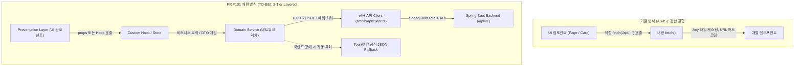

# 🌐 온마루 프론트엔드 네트워크 아키텍처 & API 활용 가이드

> **작성일**: 2026-09-19  
> **대상**: 온마루 프론트엔드 개발팀 및 신규 기여자  
> **관련 PR**: [PR #101 (New feature)](https://github.com/YRootLab/OnMaru-Frontend/pull/101)  
> **관련 이슈**: Issue #88 ~ #97 (Spring Boot 백엔드 연동)

---

## 📌 1. 개요 (Overview)

온마루 프론트엔드는 기존의 공공데이터(TourAPI/Odii) 프록시 및 정적 목업(Mock) 중심 구조에서, **Spring Boot 정식 백엔드(`/v3/api-docs` 기준 REST API 42종)와 실시간 연동되는 고도화된 3계층 네트워크 아키텍처**로 전면 개편되었습니다.

이 문서는 **"기존에 네트워크를 어떻게 호출했는지"**, **"PR #101에서 어떻게 객체화하고 개선했는지"**, 그리고 **"앞으로 UI(Presentation) 컴포넌트에서 이 네트워크 객체들을 어떻게 호출하고 개발해야 하는지"**를 초보자도 쉽게 이해할 수 있도록 설명합니다.

---

## 🔄 2. 기존 방식 vs PR #101 개편 방식 비교 (AS-IS vs TO-BE)



### ❌ 기존 방식 (AS-IS)의 문제점
1. **컴포넌트 내부에서 직접 `fetch()` 호출**:
   - UI 컴포넌트 파일 안에 `fetch('/api/village/...')`와 같은 URL 문자열과 에러 처리 코드가 섞여 있어 코드가 길어지고 가독성이 떨어졌습니다.
2. **타입 안전성 부재 (`any` 남발)**:
   - 백엔드가 주는 응답 데이터가 어떤 형태인지 알 수 없어 `res.json() as any`로 캐스팅하여 런타임 에러 위험이 컸습니다.
3. **백엔드 서버 장애 시 화면 전체 마비**:
   - 백엔드 응답이 실패하면 화면에 바로 에러가 터지거나 흰 화면(White Screen)이 노출되었습니다.
4. **중복 요청과 비효율**:
   - 동일한 데이터를 여러 컴포넌트에서 각자 `fetch`하여 불필요한 네트워크 트래픽이 발생했습니다.

---

## 🏗️ 3. PR #101에서 구축된 4가지 핵심 네트워크 구조

### 3-1. OpenAPI 기반 자동 타입 동기화 (`src/types/api.generated.d.ts`)
- Spring Boot의 `/v3/api-docs` 스펙을 `openapi-typescript`를 통해 3,400+ 라인의 TypeScript 타입으로 완전 자동 생성했습니다.
- 백엔드의 DTO나 파라미터가 바뀌어도 `npm run generate:api-types` 명령어 한 번으로 프론트엔드 타입이 완벽히 동기화됩니다.

### 3-2. 단일 통신 허브: 공용 API 클라이언트 (`src/lib/api/client.ts`)
- 모든 네트워크 요청의 입출구를 하나로 통일했습니다.
- **주요 기능**:
  - `apiGet`, `apiPost`, `apiPatch`, `apiDelete` 공통 메서드 제공
  - CSRF 토큰 자동 발급 및 헤더 주입 (`X-CSRF-TOKEN`)
  - 10초 타임아웃 방어 및 AbortController 신호 전달
  - 공통 에러 정규화 (`ApiError`, `isOnmaruApiError`)

### 3-3. 도메인별 서비스(Service) 객체 분리
비즈니스 로직과 API 호출을 도메인별 전용 객체로 캡슐화했습니다.

| 도메인 | 파일 경로 | 주요 역할 |
| :--- | :--- | :--- |
| **장소/한옥** | `src/features/map/services/place.service.ts` | 백엔드 장소 조회 + 2시간 메모리 캐시 + Fallback |
| **지도 인사이트** | `src/features/map/services/mapInsights.service.ts` | 지역별 방문자 수, 온기도 통계 수집 |
| **AI 여정 큐레이터** | `src/features/journey-curator/api/journeyCuratorApi.ts` | 여정 탐색, 스레드 대화, 실시간 SSE 연결 |
| **방문 후기** | `src/features/visit-review/api/visitReviewApi.ts` | 여행자 온기 후기 작성, 조회, 감정 평점 |
| **인증/유저** | `src/features/auth/`, `src/lib/api/client.ts` | 로그인, 세션 갱신, 회원 프로필, 회원 탈퇴 |

### 3-4. Fallback & Resilient Adapter (장애 대응)
- 백엔드 서버가 점검 중이거나 장애가 발생해도, 서비스 객체 내부에서 자동으로 **TourAPI 공공데이터 및 검증된 정적 Fallback 데이터**로 즉시 전환되어 사용자 화면이 멈추지 않습니다.

---

## 💎 4. 네트워크 객체를 만들면 무엇이 좋은가요? (5가지 장점)

1. **관심사의 완벽한 분리 (Separation of Concerns)**:
   - UI 컴포넌트는 "화면을 어떻게 예쁘게 그릴지"에만 집중하고, 네트워크 객체는 "데이터를 어떻게 안전하게 가져올지"만 담당합니다.
2. **타입 자동 완성 및 컴파일 타임 에러 검출**:
   - IDE에서 `item.`을 치는 순간 백엔드 필드명이 자동 완성되며, 백엔드 스펙이 바뀌면 TypeScript 컴파일러(`npx tsc --noEmit`)가 즉시 오류 위치를 찾아줍니다.
3. **유지보수 비용 대폭 절감**:
   - API 주소나 파라미터 규격이 바뀌어도 수십 개의 컴포넌트를 뒤질 필요 없이 **해당 Service 파일 1곳만 수정**하면 프로젝트 전체에 즉시 반영됩니다.
4. **쉬운 테스트와 모킹 (Testability)**:
   - UI 컴포넌트를 테스트할 때 가짜(Mock) Service 객체만 주입하면 되므로 백엔드 서버 없이도 UI 테스트가 가능합니다.
5. **중앙 집중 보안/정책 관리**:
   - 토큰 갱신, CSRF 처리, 타임아웃, 재시도(Retry) 로직이 공용 클라이언트 한곳에서 일관되게 처리됩니다.

---

## 🚀 5. 앞으로 Presentation(UI) 단에서 어떻게 개발해야 하나요?

우리 프로젝트의 기본 원칙은 **"Data flows in, not out (데이터는 외부에서 안으로 흐른다)"**입니다.  
UI 컴포넌트 본문 안에서 절대 `fetch()`나 비동기 통신을 직접 실행하지 마세요.

### 📌 패턴 1: Server Component에서 Service 호출 후 Props로 전달 (가장 추천 ⭐)

정적/초기 렌더링에 필요한 데이터는 페이지 서버 컴포넌트(`page.tsx`)에서 Service를 호출하고, UI 컴포넌트에는 순수 데이터만 내려줍니다.

```tsx
// app/places/page.tsx (Server Component)
import { PlaceListPresentation } from '@/features/map/components/PlaceListPresentation';
import { placeService } from '@/features/map/services/place.service';

export default async function PlacesPage() {
  // 1. 서버에서 도메인 Service 객체를 통해 데이터 패치
  const places = await placeService.getPlacesByRegion('11'); // 서울 권역

  // 2. UI 컴포넌트에는 완성된 props만 주입 (컴포넌트는 순수 UI 함수)
  return <PlaceListPresentation places={places} />;
}
```

---

### 📌 패턴 2: Client Component에서 전용 Hook을 통한 데이터 바인딩 (필터/사용자 상호작용)

클라이언트 상태(검색어, 필터 탭 선택)에 따라 실시간 조회가 필요할 때는 `features/<도메인>/hooks/use<Name>.ts` 훅을 거쳐서 가져옵니다.

```tsx
// 1. Custom Hook 작성 (src/features/map/hooks/usePlaceList.ts)
import { useState, useEffect } from 'react';
import { placeService } from '@/features/map/services/place.service';
import type { Item } from '@/features/map/types';

export function usePlaceList(regionCode: string) {
  const [data, setData] = useState<Item[]>([]);
  const [loading, setLoading] = useState(true);
  const [error, setError] = useState<Error | null>(null);

  useEffect(() => {
    let cancelled = false;
    setLoading(true);

    placeService.getPlacesByRegion(regionCode)
      .then((items) => {
        if (!cancelled) setData(items);
      })
      .catch((err) => {
        if (!cancelled) setError(err);
      })
      .finally(() => {
        if (!cancelled) setLoading(false);
      });

    return () => { cancelled = true; };
  }, [regionCode]);

  return { data, loading, error };
}

// 2. UI 컴포넌트에서 Hook 호출 (src/features/map/components/PlaceListView.tsx)
'use client';

import React from 'react';
import { usePlaceList } from '../hooks/usePlaceList';
import { PlaceSkeleton } from './PlaceSkeleton';

export function PlaceListView({ selectedRegion }: { selectedRegion: string }) {
  const { data: places, loading } = usePlaceList(selectedRegion);

  if (loading) return <PlaceSkeleton />; // 스켈레톤 1:1 규격 동기화

  return (
    <ul>
      {places.map((place) => (
        <li key={place.contentId}>{place.title}</li>
      ))}
    </ul>
  );
}
```

---

### 📌 패턴 3: 사용자 액션(버튼 클릭, 좋아요, 등록) 처리

사용자가 버튼을 누르거나 폼을 제출할 때는 해당 도메인 Service/API 함수를 핸들러에서 직접 호출합니다.

```tsx
// src/features/visit-review/components/ReviewSubmitButton.tsx
'use client';

import React, { useState } from 'react';
import { visitReviewApi } from '@/features/visit-review/api/visitReviewApi';
import { toast } from 'sonner';

export function ReviewSubmitButton({ placeId, content }: { placeId: string; content: string }) {
  const [submitting, setSubmitting] = useState(false);

  const handleSubmit = async () => {
    try {
      setSubmitting(true);
      // 백엔드 API 서비스 객체 직접 호출
      await visitReviewApi.createReview({
        placeId,
        content,
        rating: 5,
      });
      toast.success('온기 후기가 성공적으로 등록되었습니다!');
    } catch (error) {
      toast.error('후기 등록에 실패했습니다.');
    } finally {
      setSubmitting(false);
    }
  };

  return (
    <button onClick={handleSubmit} disabled={submitting}>
      {submitting ? '등록 중...' : '온기 남기기'}
    </button>
  );
}
```

---

## 📋 6. 개발 체크리스트 (Good vs Bad)

| 항목 | ❌ Bad (피해야 할 작성법) | ✅ Good (올바른 작성법) |
| :--- | :--- | :--- |
| **URL 작성** | `fetch('https://api.onmaru.../places')` 하드코딩 | `placeService.getPlaces()` 호출 |
| **데이터 타입** | `const data = res.json() as any` | `api.generated.d.ts` 자동 생성 타입 활용 |
| **에러/장애 대응** | 컴포넌트마다 제각각 `try/catch` 작성 | Service 레이어에서 Fallback/정규화 에러 자동 처리 |
| **컴포넌트 역할** | 컴포넌트 하나에 UI + Fetch + 데이터 가공 혼재 | 컴포넌트는 UI만 렌더링, 로직은 `hooks` / `services`로 분리 |
| **로딩 상태** | 임의의 Spinner 표시로 레이아웃 깜빡임 | 실제 카드 규격과 1:1 일치하는 Skeleton UI 제공 |

---

## 🎯 결론 및 향후 개발 가이드

1. **새로운 백엔드 기능이 추가되었을 때**:
   - `npm run generate:api-types`를 실행하여 최신 DTO 타입을 갱신합니다.
   - `src/features/<도메인>/services/<이름>.service.ts`에 비즈니스 함수를 추가합니다.
2. **새로운 화면/컴포넌트를 만들 때**:
   - `fetch()`를 직접 쓰지 않고, 이미 만들어진 `service` 또는 전용 `hook`을 import하여 바인딩합니다.
3. 이 규칙을 지키면 백엔드 API가 변경되거나 확장되어도 프론트엔드 UI의 손상 없이 견고하고 빠른 개발을 유지할 수 있습니다.
